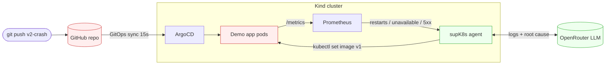
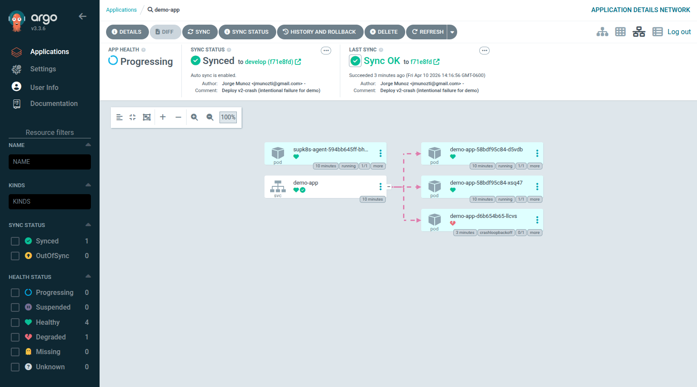
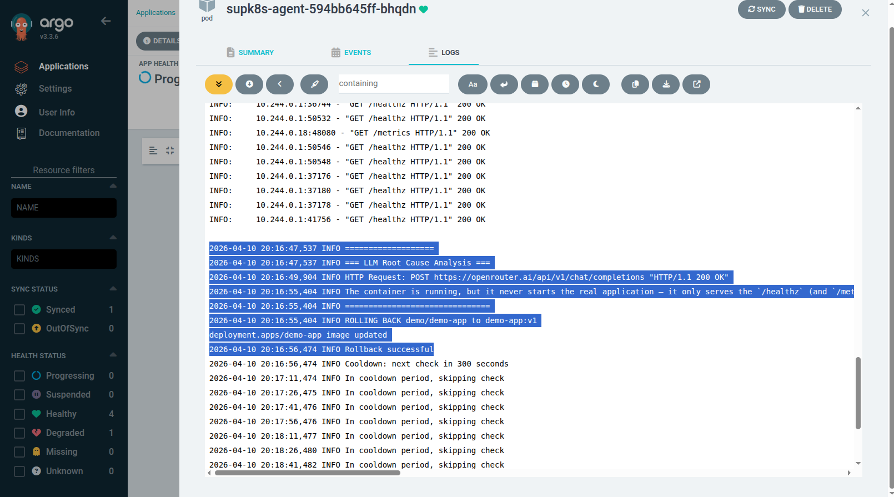

# supK8s

> *"Sup, K8s?" — an AIOps agent that auto-rollbacks bad Kubernetes deployments.*

Your cluster breaks at 3am. supK8s detects the crash, asks an LLM to explain it, rolls back, and goes back to sleep — before anyone gets paged.

## How it works



1. A bad image gets committed to the repo (real GitOps — no `kubectl apply`).
2. ArgoCD syncs it into the cluster within ~15s.
3. Pods enter `CrashLoopBackOff`.
4. Prometheus surfaces the restarts via `kube-state-metrics`.
5. The agent crosses its error threshold, fetches the failing pod's logs, and sends them to an OpenRouter LLM for root-cause analysis.
6. Agent runs `kubectl set image` to roll back to `v1`, then enters cooldown.




## Quick start

### Prerequisites

- Docker, Kind, kubectl, Helm, git
- An [OpenRouter API key](https://openrouter.ai/keys) (free) — the agent **refuses to start without it**

### 1. Fork & clone

The simulation pushes commits to GitHub and lets ArgoCD pull them, so ArgoCD must point at a repo *you* can push to.

```bash
# Fork on GitHub, then:
git clone git@github.com:<your-user>/supk8s.git
cd supk8s
```

### 2. Configure

```bash
# Required: ArgoCD repo URL
sed -i "s|jmunozti|<your-user>|" config.env

# Required: OpenRouter API key (gitignored)
echo 'OPENROUTER_API_KEY=sk-or-v1-...' > .env
```

### 3. Deploy

```bash
make deploy
```

This creates a Kind cluster, installs ArgoCD + Prometheus, builds and loads the demo app and agent images, and wires up the GitOps app.

### 4. Trigger an incident

```bash
make simulate-failure   # commits v2-crash → ArgoCD deploys it → agent rollbacks
make recover            # ALWAYS run this after, see note below
```

> ⚠️ **Always run `make recover` after `make simulate-failure`.** It commits the healthy `v1` image back to the repo. If you skip it, `k8s/base/demo-app.yaml` stays pinned to `v2-crash` and your next `make deploy` will hang at *"Waiting for demo app..."*.

### Access

| Service | URL | Credentials |
|---------|-----|-------------|
| Demo App | http://localhost:30080 | — |
| ArgoCD | http://localhost:30443 | `admin` / `supk8s-admin` |
| Prometheus | http://localhost:30090 | — |

### Commands

```bash
make deploy             # Create cluster + deploy everything
make simulate-failure   # Push broken image, watch agent rollback
make recover            # Push healthy image back
make status             # Pods, ArgoCD apps, agent logs
make logs               # Stream agent logs
make clean              # Destroy the cluster
```

## Detection signals

The agent uses three Prometheus signals — any one of them is enough to trigger a rollback:

| Signal | Catches | Needs traffic? |
|---|---|---|
| `kube_pod_container_status_restarts_total` (delta) | `CrashLoopBackOff` | No |
| `kube_deployment_status_replicas_unavailable` | Pods that won't start | No |
| `rate(http_requests_total{status="500"})` | App-level 5xx errors | Yes |

## Tech stack

| Layer | Choice |
|---|---|
| GitOps | ArgoCD (15s reconciliation) |
| Monitoring | Prometheus + kube-state-metrics |
| Orchestration | Kubernetes (Kind locally; portable to EKS/GKE/AKS) |
| Demo app | FastAPI + Python 3.12 |
| Agent | Python 3.12 (22 unit tests) |
| LLM analysis | OpenRouter (OpenAI-compatible API, free models) |
| Containers | Multi-stage Docker, non-root, healthchecks |
| CI | GitHub Actions (Trivy + ruff + YAML validation) |

## Security

- Non-root containers, multi-stage builds
- RBAC scoped to the watched namespace only
- OpenRouter API key delivered via Kubernetes Secret (`supk8s-llm`), loaded from a gitignored `.env`
- Trivy CVE scan on every CI run

## License

MIT
